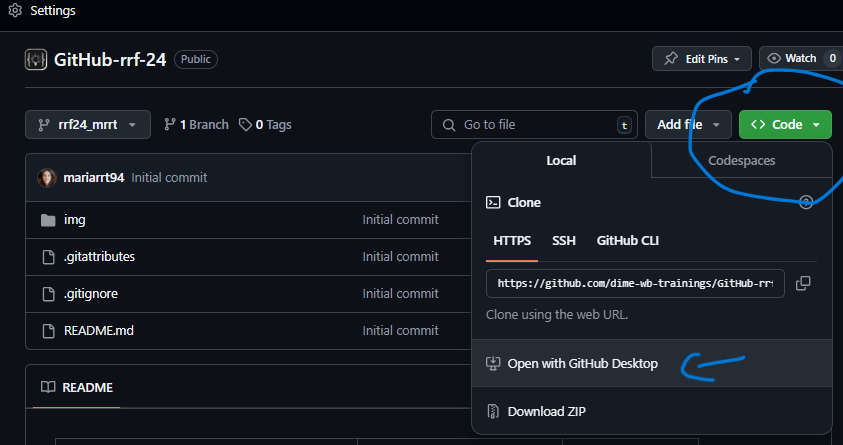
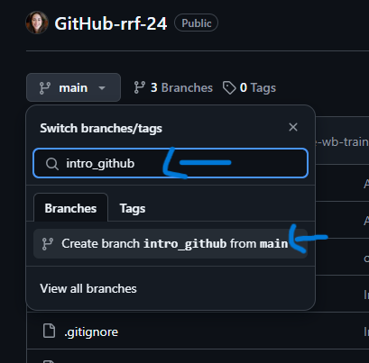
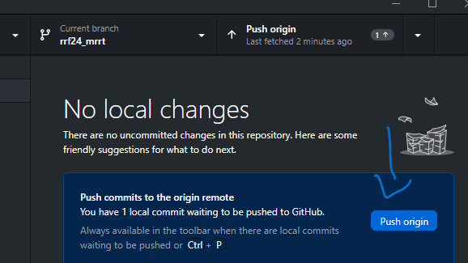

# Reproducible Research Fundamentals 2024
## Using GitHub for Collaborative Research - README

## Introduction

Welcome to the DIME Analytics training on GitHub and reproducible workflows. Over the next four days, you will learn how to implement transparent and reproducible workflows. This starts with essential GitHub skills and how to apply them in your data projects. The end goal is for you to use GitHub to work on all stages of the data workflow, from data management to cleaning, tidying, constructing indicators, analysis, and exporting reproducible outputs.

This repository will be your workspace for the entire training. Follow the steps outlined below to set up your environment. Once set up, you will continue to work on this repository for the remainder of the sessions.

## Project Overview

In this part of the training, you will learn to:

- Clone a GitHub repository.
- Create a branch for your work.
- Make commits and push changes.
- Follow a structured workflow for reproducibility.

## Training Day 1: Intro to GitHub

### Setting Up Your GitHub Repository

### 1. Clone the Repository

1. Go to the GitHub repository: [GitHub-rrf24](https://github.com/dime-wb-trainings/GitHub-rrf-24).
2. Click the green "Code" button and select "Open with GitHub Desktop."
3. Follow the prompts to clone the repository to your local machine.

You will now have a local copy of the repository to work on.

### 2. Create a New Branch

1. After cloning the repository, you need to create a branch where you will work.
2. Open GitHub Desktop.
3. Click on the "Current Branch" dropdown.
4. Type `rrf24_<your_initials>` and click "Create new branch."

- After you click, this pop-up will appear. Select "create branch"

- After you create a branch, GitHub will move you to that branch, but you can also switch between branches.

**Important**: You will continue working on your branch(es) for the rest of the training, and it will be reviewed by a peer at the end. In the next GitHub session, we will cover more advanced workflows, but **avoid committing to the main branch**. Only commit to your own branch(es).

### 3. Make a Minor Change and Commit

0. Make sure your branch is checked out (the tick is on your branch)
1. Open the `language>README.md` file in your cloned repository in the folder of your language chosen. (Stata or R)
2. Add a line at the top: `### Reproducible Research Fundamentals 2024 <your_name>.`
3. Save the file.
4. Go back to GitHub Desktop, and you will see the change.
5. Add a description and message to your commit `Add: name to README` 
6. Click "Commit to <your_branch>".

You have now successfully set up your repository, created a branch, and made your first commit!

### 4. Push/Publish Your Changes

6. After committing, click the "Push" button in GitHub Desktop to publish your changes on github.com.

---

## Key Reminders for the Week

- **You will continue working in your branch/branches for all sessions.**
- Each session will build on the previous one, and by the end, you will create a reproducibility package.
- Make sure to **commit and push** changes regularly to keep your work up-to-date and trackable.

---

## Overview of Upcoming Sessions

1. **GitHub Workflow**: Explore best practices for GitHub collaboration, branching, and merging.
2. **Setting a reproducible environment**: Start projects clean, share package versions, and ensure reproducibility across systems and time.
3. **Data Processing**: Learn how to tidy and clean your data.
4. **Preparing Data for Analysis**: Focus on structuring your data for robust analysis.
5. **Data Analysis**: Conduct analysis using your organized datasets.
6. **Creating a Reproducibility Package**: Package your work following reproducibility guidelines, including a comprehensive README and proper documentation.

We look forward to seeing your progress throughout the week!

---

### Useful Links:

- DIME Analytics GitHub trainings: [DIME GitHub Trainings](https://osf.io/e54gy/)
- Markdown Cheat Sheet: [Markdown Guide](https://www.markdownguide.org/cheat-sheet/)
